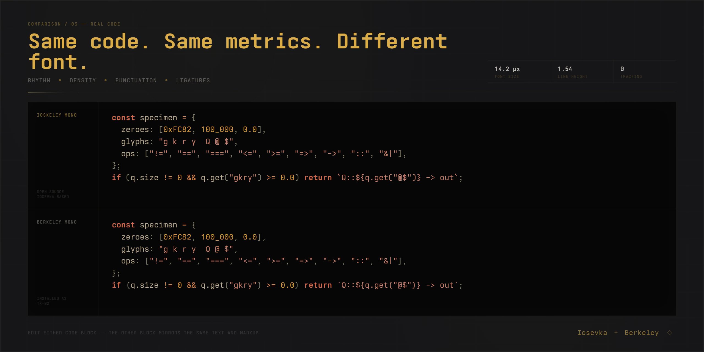

# Ioskeley Mono — Slashed Zero

> This fork tracks [the upstream Ioskeley Mono project](https://github.com/ahatem/IoskeleyMono) and sets the default zero glyph to slashed in `private-build-plans.toml`.

<p align="center">
  
</p>

<p align="center">
  <a href="https://github.com/ahatem/IoskeleyMono/releases/latest"></a>
  <a href="https://github.com/ahatem/IoskeleyMono/releases"></a>
  <a href="./LICENSE"></a>
  <a href="https://ahatem.github.io/IoskeleyMono/"></a>
</p>

<p align="center">
  <strong>A compact, geometric programming typeface built with Iosevka.</strong><br>
  Tuned for editors, terminals, and the web. Inspired by the character of Berkeley Mono.
</p>

<p align="center">
  <a href="https://ahatem.github.io/IoskeleyMono/"><strong>Try the live showcase</strong></a>
  &nbsp;·&nbsp;
  <a href="https://github.com/ahatem/IoskeleyMono/releases/latest"><strong>Download the latest release</strong></a>
</p>

<p align="center">
  <sub>Ioskeley Mono is free to use. Stars, shared setups, bug reports, and contributions all help the project grow.</sub>
</p>

<p align="center">
  <a href="#why-i-built-ioskeley-mono">Story</a> ·
  <a href="#downloads--variants">Downloads</a> ·
  <a href="#design">Design</a> ·
  <a href="#installation">Installation</a> ·
  <a href="#editor-configuration">Configuration</a> ·
  <a href="#build-from-source">Build</a>
</p>

---

## Why I Built Ioskeley Mono

For a long time, Berkeley Mono was the font I dreamed of using one day. I loved its compact proportions, geometric shapes, and the character it gave to code. But I could not afford it at the time, so I kept searching for a free typeface that could give me a similar feeling.

Eventually, I found [Iosevka](https://github.com/be5invis/Iosevka) and realized I could shape something of my own. I generated and tested more than a hundred builds—installing and uninstalling them, zooming in and out, comparing individual glyphs, adjusting spacing and proportions, and repeatedly trying the font in real editors. I kept refining it until it felt as close as I could make it to what I had imagined.

Ioskeley Mono grew out of that process. I made it for anyone who admires this kind of carefully designed programming typeface but cannot justify the price of a commercial font—especially students, people beginning their careers, or anyone who simply wants a distinctive coding font without a high price standing in the way.

It is not Berkeley Mono, nor is it intended to replace the original. It is an independent typeface built with Iosevka, shaped by the qualities that inspired me, and shared freely so more people can enjoy that same kind of character in their own work.

## Downloads & Variants

Not sure which file to choose? Start with **[`IoskeleyMono.zip`](https://github.com/ahatem/IoskeleyMono/releases/latest/download/IoskeleyMono.zip)** for an editor or **[`IoskeleyMono-Term.zip`](https://github.com/ahatem/IoskeleyMono/releases/latest/download/IoskeleyMono-Term.zip)** for a terminal.

| Package | Best for | Ligatures | Nerd Font icons |
|---|---|:---:|:---:|
| **[`IoskeleyMono.zip`](https://github.com/ahatem/IoskeleyMono/releases/latest/download/IoskeleyMono.zip)** | VS Code, JetBrains IDEs, Zed, Sublime Text, Cursor | Yes | No |
| **[`IoskeleyMono-NerdFont.zip`](https://github.com/ahatem/IoskeleyMono/releases/latest/download/IoskeleyMono-NerdFont.zip)** | Editors that need patched symbols and icons | Yes | Yes |
| **[`IoskeleyMono-Term.zip`](https://github.com/ahatem/IoskeleyMono/releases/latest/download/IoskeleyMono-Term.zip)** | Kitty, Ghostty, WezTerm, Alacritty | Yes | No |
| **[`IoskeleyMono-Term-NerdFont.zip`](https://github.com/ahatem/IoskeleyMono/releases/latest/download/IoskeleyMono-Term-NerdFont.zip)** | Terminals, prompts, and terminal-based editors that need icons | Yes | Yes |
| **[`IoskeleyMono-NL.zip`](https://github.com/ahatem/IoskeleyMono/releases/latest/download/IoskeleyMono-NL.zip)** | Apps that cannot disable ligatures, including Xcode | No | No |
| **[`IoskeleyMono-NL-NerdFont.zip`](https://github.com/ahatem/IoskeleyMono/releases/latest/download/IoskeleyMono-NL-NerdFont.zip)** | The no-ligature family with patched symbols and icons | No | Yes |
| **[`IoskeleyMono-Web.zip`](https://github.com/ahatem/IoskeleyMono/releases/latest/download/IoskeleyMono-Web.zip)** | Websites using Latin text, punctuation, arrows, math, or box drawing | Yes | No |
| **[`IoskeleyMono-Web-Full.zip`](https://github.com/ahatem/IoskeleyMono/releases/latest/download/IoskeleyMono-Web-Full.zip)** | Websites that also need the complete desktop glyph set | Yes | No |

> [!TIP]
> **Using a terminal?** Choose a `Term` package. Its spacing keeps arrows and box-drawing glyphs inside their cells.
>
> **Building a website?** Start with `IoskeleyMono-Web.zip`. Choose `Web-Full` only when you need Greek, Cyrillic, long arrows, or less common mathematical symbols. Both web archives use the same filenames, so switching between them does not require new `@font-face` rules.

### Choose Your Width

| Width | Relative width | Choose it when |
|---|:---:|---|
| **Normal** | 100% | You want the default balance of spacing and readability |
| **SemiCondensed** | 90% | You want to fit more code on each line without changing the overall design |

### Choose Your Rendering

| Display | Folder |
|---|---|
| Windows or Linux on a standard-density display | **Hinted** |
| macOS or any HiDPI display | **Unhinted** |

Install one rendering set per width to avoid duplicate font entries. Nerd Font packages do not have separate hinted and unhinted copies.

<details>
<summary><strong>See the package folder structure</strong></summary>

```text
Normal/
  Hinted/
  Unhinted/
SemiCondensed/
  Hinted/
  Unhinted/
```

</details>

## At a Glance

- **40 static styles:** 10 weights × 2 widths × upright and italic.
- **Distinctive glyph choices:** dotted zero, single-storey `g`, open `6` and `9`, two-circle `8`, flat-arc parentheses, a raised underscore, and square punctuation dots.
- **Programming ligatures:** enabled in the standard, Term, and web families, with dedicated NL builds when ligatures must stay off.
- **Slashed zero by default:** this fork sets Iosevka's `zero` design variant to `slashed` in `private-build-plans.toml`.
- **Purpose-built packages:** regular desktop, terminal, Nerd Font, no-ligature, and web variants are produced by the release workflow.

## Design

Ioskeley Mono is not a stock Iosevka build. Its [build plan](./private-build-plans.toml) defines the glyph forms, widths, slopes, spacing, and vertical metrics used across the family.

The design balances three ideas:

- **Compact rhythm** — a dense but readable texture that keeps more code in view.
- **Geometric clarity** — direct shapes, square details, and deliberately differentiated numerals.
- **A complete working family** — the same visual system across two widths, ten weights, italics, terminals, and web use.

### Comparing the Details

Berkeley Mono was the starting point for the feeling I wanted. These images show what I studied while shaping Ioskeley Mono and where the two fonts differ.

#### Character Forms

A side-by-side study of numerals, punctuation, brackets, and common programming characters.


#### Overlay Study

An overlay used to inspect baselines, proportions, shared areas, and visible edge differences.


#### Code Density

A real-code specimen comparing line rhythm, spacing, and visual weight in an editor setting.



## Weights

Every weight is included in both widths, with an upright and italic style.

| Weight | CSS `font-weight` | Upright | Italic |
|---|---:|:---:|:---:|
| Thin | `100` | Included | Included |
| ExtraLight | `200` | Included | Included |
| Light | `300` | Included | Included |
| SemiLight | `350` | Included | Included |
| Regular | `400` | Included | Included |
| Medium | `500` | Included | Included |
| SemiBold | `600` | Included | Included |
| Bold | `700` | Included | Included |
| ExtraBold | `800` | Included | Included |
| Black | `900` | Included | Included |

## Installation

### Package Managers

| System | Package | Install |
|---|---|---|
| macOS | [Homebrew](https://formulae.brew.sh/cask/font-ioskeley-mono) | `brew install --cask font-ioskeley-mono` |
| Nix / NixOS | [nixpkgs](https://github.com/NixOS/nixpkgs/tree/master/pkgs/data/fonts/ioskeley-mono) | `nix profile install nixpkgs#ioskeley-mono.normal` |
| Arch Linux | [AUR](https://aur.archlinux.org/packages/ttf-ioskeley-mono) | Package: `ttf-ioskeley-mono` |
| Slackware | [SlackBuilds.org](https://slackbuilds.org/repository/15.0/system/IoskeleyMono/) | Package: `IoskeleyMono` |

> [!NOTE]
> Package repositories update on their own schedules and may not always carry the latest Ioskeley release. The [GitHub Releases page](https://github.com/ahatem/IoskeleyMono/releases/latest) is the source of truth for current builds and every available variant.

Thanks to [@zhimoe](https://github.com/zhimoe), [@ForsakenHarmony](https://github.com/ForsakenHarmony), and [@frovere](https://github.com/frovere) for helping bring it to Homebrew.

### Manual Installation

- **macOS:** Unzip the download, select the `.ttf` files from your chosen width and rendering folder, then open them in Font Book and choose **Install**.
- **Windows:** Unzip the download, select the `.ttf` files, right-click, and choose **Install for all users**.
- **Linux:** Copy the selected `.ttf` files to `~/.local/share/fonts/IoskeleyMono/`, then run `fc-cache -fv`.

Restart open applications after installation so they can refresh their font lists.

## Editor Configuration

Use the family name that matches the package you installed.

| Package | Font family |
|---|---|
| Standard | `Ioskeley Mono` |
| Standard Nerd Font | `IoskeleyMono Nerd Font Mono` |
| Term | `Ioskeley Mono Term` |
| Term Nerd Font | `IoskeleyMonoTerm Nerd Font Mono` |
| No Ligatures | `Ioskeley Mono NL` |
| No Ligatures Nerd Font | `IoskeleyMonoNL Nerd Font Mono` |

### VS Code / Cursor

```json
{
  "editor.fontFamily": "'Ioskeley Mono', monospace",
  "editor.fontLigatures": true,
  "editor.fontWeight": "400",
  "editor.fontSize": 14.5,
  "editor.lineHeight": 1.55
}
```

### Zed

```json
{
  "buffer_font_family": "Ioskeley Mono",
  "buffer_font_size": 15,
  "buffer_line_height": "comfortable"
}
```

### Ghostty

```ini
font-family = Ioskeley Mono Term
font-size = 14
```

### Alacritty

```toml
[font.normal]
family = "Ioskeley Mono Term"
style = "Regular"
```

### Kitty

```conf
font_family      Ioskeley Mono Term
bold_font        auto
italic_font      auto
bold_italic_font auto
font_size        14.0
```

## OpenType Features

Ioskeley Mono includes OpenType features that compatible applications can enable or disable.

| Feature | Effect |
|---|---|
| `zero` | Provides the alternate zero glyph; this fork selects the slashed design by default |
| `calt` | Enables contextual programming ligatures. On by default where supported |
| `dlig` | Enables discretionary ligatures |
| `onum` | Uses old-style figures |
| `frac` | Formats fractions |

```jsonc
// VS Code / Cursor
"editor.fontLigatures": "'calt', 'zero'"
```

```ini
# Ghostty
font-feature = zero
```

```conf
# Kitty
font_features IoskeleyMonoTerm +zero
```

```css
/* CSS */
font-feature-settings: "zero";
```

## Build from Source

Release builds are produced by [GitHub Actions](.github/workflows/build-font.yml). The current workflow pins Iosevka `v34.4.0` so tagged releases remain reproducible.

```bash
# Clone the project and the pinned Iosevka source
git clone https://github.com/ahatem/IoskeleyMono.git
git clone --branch v34.4.0 --depth 1 https://github.com/be5invis/Iosevka.git

# Copy the custom build plan
cp IoskeleyMono/private-build-plans.toml Iosevka/

# Install dependencies and build every family
cd Iosevka
npm install
npm run build -- contents::IoskeleyMono contents::IoskeleyMonoTerm contents::IoskeleyMonoNL contents::IoskeleyMonoWeb
```

Compiled files are written to `Iosevka/dist/<PlanName>/`. The release workflow also creates the hinted, Nerd Font, and packaged download variants.

## Contributing

Bug reports, glyph refinement proposals, ligature suggestions, documentation fixes, and build-plan improvements are welcome.

- Review [`private-build-plans.toml`](./private-build-plans.toml) before proposing a character or metric adjustment.
- Use [GitHub Issues](https://github.com/ahatem/IoskeleyMono/issues) for reproducible problems and design suggestions.
- Use a pull request when you already have a tested change.

## Help Ioskeley Grow

Ioskeley Mono is free and open source. Support does not have to mean money—the most useful things are often the simplest:

- **Star the repository** so more people can discover it.
- **Share your setup** and show how the font looks in your editor or terminal.
- **Report anything that feels off**, from a glyph or spacing issue to an installation problem.
- **Contribute an improvement** to the build plan, documentation, packaging, or showcase.

If Ioskeley Mono has become part of your daily setup and you would also like to support the time behind it, you can use [GitHub Sponsors](https://github.com/sponsors/ahatem) or [Buy Me a Coffee](https://www.buymeacoffee.com/ahmedhatem).

Financial support is completely optional. It does not unlock a separate version of the font. It simply makes it easier to spend more time testing builds, refining glyphs, packaging releases, and maintaining the showcase.

## License & Acknowledgments

Ioskeley Mono is released under the [SIL Open Font License 1.1](./LICENSE). You may use it in personal and commercial work, including documents, applications, websites, and published media. If you redistribute the font itself or a modified version, follow the conditions in the license.

The family is built with [Iosevka](https://github.com/be5invis/Iosevka), created by [Belleve Invis](https://github.com/be5invis) and its contributors. Iosevka provides the typeface construction system, glyph repertoire, and build tooling that made this project possible.

The design direction was inspired by **Berkeley Mono**, created by Neil Panchal / [Berkeley Graphics](https://berkeleygraphics.com/typefaces/berkeley-mono/). Berkeley Mono is a commercial typeface. Ioskeley Mono is an independent Iosevka-based project. It is not affiliated with or endorsed by Berkeley Graphics.

If you enjoy the original design and are in a position to do so, please consider purchasing Berkeley Mono. Supporting independent type designers helps more thoughtful typefaces get made.
